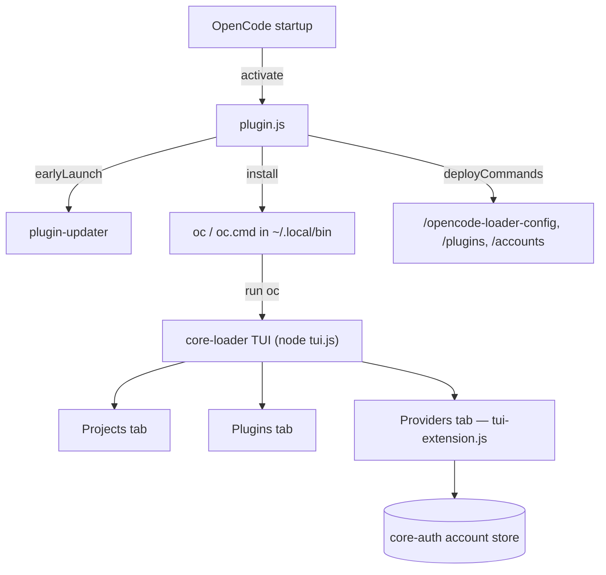

# opencode-loader

[](https://www.npmjs.com/package/opencode-loader)
[](https://www.npmjs.com/package/opencode-loader)
[](https://github.com/intisy-ai/opencode-loader/actions)

TUI launcher and `oc` shell command for [OpenCode](https://github.com/sst/opencode). When loaded as an OpenCode plugin it installs an `oc` command into your shell; running `oc` opens an interactive TUI for switching between projects, managing plugins, and signing in to providers. It also drives [plugin-updater](https://github.com/intisy-ai/plugin-updater) on startup so all your git-based plugins stay current.

## Under-the-Hood Architecture



## Structure

- `src/`
  - `plugin.ts` — the OpenCode plugin entry (`activate`/`cleanup`); installs the `oc` wrapper, runs plugin-updater, deploys commands. Also acts as the command CLI (`node plugin.js <config|plugins|accounts>`).
  - `tui-extension.ts` — the loader's custom Providers tab (auto-discovers installed providers).
  - `commands.ts` — cross-app slash-command definitions + their CLI actions.
  - `core-loader/` — git submodule ([`intisy-ai/core-loader`](https://github.com/intisy-ai/core-loader)): the TUI engine (`core-loader/dist/tui.js`), built and bundled at publish time.
  - `core/` — git submodule ([`intisy-ai/core`](https://github.com/intisy-ai/core)): shared config + the cross-app command framework, bundled to `core/dist/index.js`.
- `dist/`
  - compiled output (generated; not committed).

## Requirements

- Node.js 20+ (the TUI runs under Node — no Bun required; it reads the OpenCode session DB via Node 22+'s built-in `node:sqlite`, falling back to `bun:sqlite` when run under Bun).

## Installation

### Via plugin-updater (recommended)

```bash
npx plugin-updater@latest init https://github.com/intisy-ai/opencode-loader
```

### Via npm

```bash
npm install opencode-loader
```

## Plugin-updater entry

When using plugin-updater, add this entry to `~/.config/opencode/config/plugins.json`:

```json
{ "name": "opencode-loader", "url": "https://github.com/intisy-ai/opencode-loader", "enabled": true, "autoUpdate": true }
```
Restart OpenCode — the updater clones, builds (including the submodules), and loads it.

When using npm directly, add to `~/.config/opencode/opencode.json`:

```jsonc
{ "plugins": ["opencode-loader@latest"] }
```

## Usage

```bash
oc              # Launch the TUI
oc 3            # Open project #3 directly
oc myproject    # Open the first project matching "myproject"
```

### Keyboard shortcuts

| Key | Projects tab | Plugins tab |
|-----|--------------|-------------|
| ↑↓ / W S | Navigate | Navigate |
| Enter | Open action menu | Open action menu |
| O | Open project | — |
| P | Pin/Unpin | — |
| H / U | Hide / Unhide all | — |
| F | — | Fetch remote updates |
| A | — | Toggle auto-update |
| ← → | Switch tabs | Switch tabs |
| Q | Quit | Quit |

## Commands

Deployed automatically on activation to both apps' command directories (`~/.config/opencode/command/` and `~/.claude/commands/`):

| Command | Description |
| --- | --- |
| `/opencode-loader-config` | View/change loader config (`opencode-loader.json`): `list`, `get <key>`, `set <key> <value>`. 100% of the config is reachable here. |
| `/plugins` | List the loader-managed plugins and their state (from `plugins.json`). |
| `/accounts` | List signed-in accounts across all providers (from the core-auth store). |

## Configuration

Config file: `<configDir>/config/opencode-loader.json` (edit via the loader or `/opencode-loader-config set`).

```json
{
  "logging": true,
  "auto_update_check": true,
  "update_check_delay_ms": 1500,
  "update_check_interval_hours": 24,
  "catalog_cache_hours": 6,
  "default_tab": "projects"
}
```

| Key | Default |
| --- | --- |
| `logging` | `true` |
| `auto_update_check` | `true` |
| `update_check_delay_ms` | `1500` |
| `update_check_interval_hours` | `24` |
| `catalog_cache_hours` | `6` |
| `default_tab` | `"projects"` |

## Configuration (extra)

The TUI also stores its own settings in `config/oc-config.json` and the plugin list in `config/plugins.json`.

## Dependencies

- `core-loader`
- `core`
- `plugin-updater`
- `Bun`

## Logging

Logs are written to `<configDir>/logs/YYYY-MM-DD/opencode-loader-HH-MM-SS.log` and are toggled by
this plugin's `logging` config (default on). Console mirroring is global, off by default,
and controlled by the shared `config/settings.json` `logConsole` flag.

## License

MIT.
